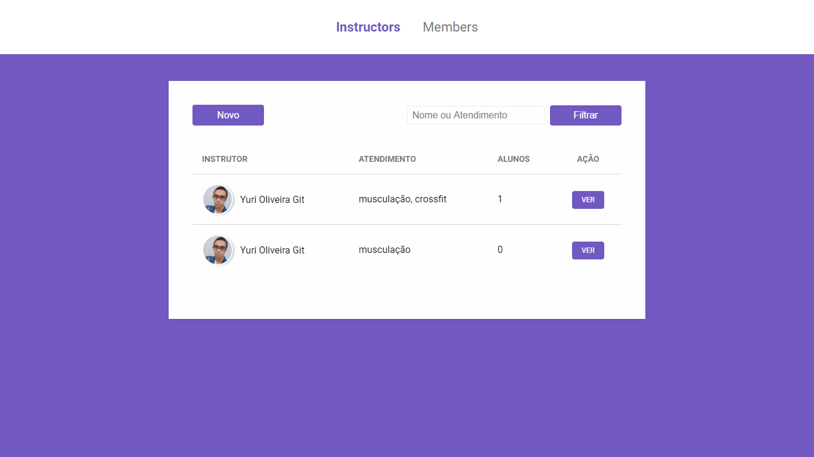

<h1 align="center">
     
        
      
        Gym Manager 
</h1>

    

        Aplicação criada para realizar o Controle de uma Academia, com registro de Instrutores e Membros.  Feito com Express, Nunjucks, CSS e PostGres.
          
        Application created to perform the Control of a Gym, with registration of Instructors and Members.  Made with Express, Nunjucks, CSS and PostGres.
    

  

    
        
        
  

## Features

<!-- Challenges undertaken to present / strengthen WEB development concepts, including:

- Variables
- Conditional
- Operators
- Objects
- Vector
- Functions and methods
- Repeating structures
- Scopes
- Booleans
- Organization
- Standardization
- Writing -->

## Getting started

<!-- As this is an introductory project, there is no installation tutorial. Just open and enjoy. -->

## License

<!-- Released in 2020. This project is under the MIT license.

Made with care and love by Yuri Oliveira 🚀 -->
