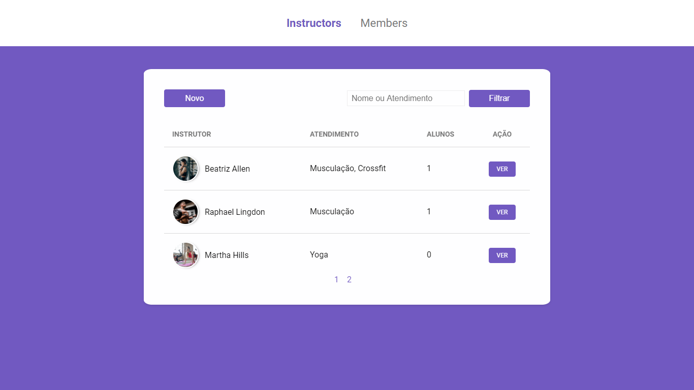

<h1 align="center">
     
        
      
        Gym Manager 
</h1>

    

        Application created to perform the Control of a Gym, with registration of Instructors and Members.  Made with Express, Nunjucks, CSS and PostGres.
    

  

    
    
    
  

## Features

- 🏋️ Register and manage academy instructors
- 🚴 Control member information

## Explored and implemented concepts

- [X] MVC model
- [X] Database creation
- [X] Database connection
- [X] Applying CRUD
- [X] Relationships between tables
- [X] Search filters
- [X] Pagination
- [X] Finished Project

## Getting started

Coming soon

<!-- As this is an introductory project, there is no installation tutorial. Just open and enjoy. -->

## License

Released in 2020. This project is under the MIT license.
Made with care and love by Yuri Oliveira 🚀.